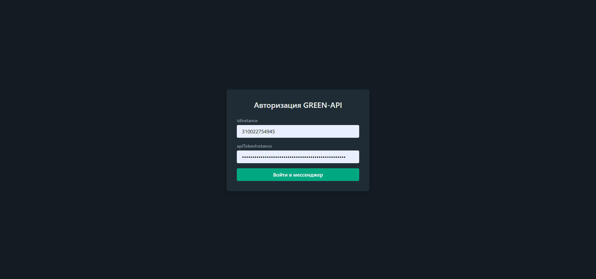

# MaxApp Messenger (GREEN-API)

Клиентское веб-приложение для обмена сообщениями через MAX с использованием **GREEN-API**. Проект разработан в рамках тестового задания на позицию **Frontend Developer (React)**.

## Стек технологий

- **React** (функциональные компоненты, кастомные хуки)
- **TypeScript** (строгая типизация всей кодовой базы и API-ответов)
- **Vite** (быстрая сборка и разработка)
- **Tailwind CSS** (адаптивная стилизация по мотивам MAX Web)
- **GREEN-API** (интеграция для авторизации, проверки статусов и обмена сообщениями)

## Основной функционал

- **Авторизация:** Вход в систему по учетным данным `idInstance` и `apiTokenInstance` из личного кабинета GREEN-API.
- **Управление чатами:** Добавление новых чатов по номеру телефона и переключение между ними.
- **Обмен сообщениями:** Отправка и получение текстовых сообщений в реальном времени с использованием методов `sendMessage` и технологии HTTP API.
- **Статус соединения:** Индикатор текущего состояния подключения к шлюзу.

## Локальный запуск проекта

Для запуска проекта выполните следующие шаги:

1. **Клонируйте репозиторий:**

   git clone [https://github.com/Andrey-G1Thub/Green-Api-Messenger.git](https://github.com/Andrey-G1Thub/Green-Api-Messenger.git)

2. **Перейдите в папку проекта:**

- cd Green-Api-Messenger

3. **Установите зависимости:**

- npm install

4. **Запустите проект в режиме разработки:**

- npm run dev

5. Откройте в браузере ссылку, указанную в терминале (обычно http://localhost:5173).

